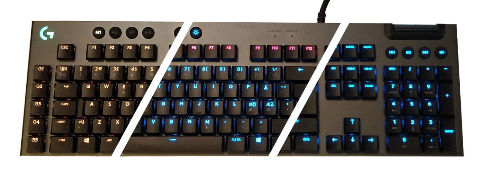

# Artokai.KeyboardLedDriver

Keyboard Led Driver is a Windows C# application which runs in the background and changes your 
Logitech RGB keyboard colours based on the status of your VPN connection and by
polling the status of your build / system monitors.



Since some of the services, whose status you might want to poll might be behind firewalls,
the communication is done via Azure Functions. The services post their statuses to
Azure Table Storage via Azure Functions from where the application running on your computer
periodically polls them.

## Keyboard Led Driver

Keyboard Led Driver is the application which runs on your local machine. It listens to network changes 
and polls the Azure functions for possible status updates and colors your keyboard leds accordingly.

### Prerequisites

Before you can build the project, you need to download the Logitech SDK and add a couple of files to the project:

1. Download the Logitech's LED ILLUMINATION SDK from their website
2. Copy the files `LogitechLedEnginesWrapper.dll` and `LogitechGSDK.cs` from the SDK to the project directory. 

You also need to add a valid `appsettings.json` file to the project root. This file contains the url address of the Azure Function from where the application periodically polls for error statuses which control the colour of the function keys. If you haven't set up the Azure Functions yet, you can also set the `enabled` setting to `false` and leave the url empty.

### Build the project

Build the project using the following command:

```
dotnet restore
dotnet build --configuration Release
```

### Run the keyboard driver on startup

1. Navigate to Windows Startup foler (`Windows + R` + `shell:startup` + `Ok`)
2. Add a shortcut to `Artokai.KeyboardLedDriver.exe`

## Azure functions

The colour of your function keys are controlled by Azure Functions. 
You can configure your build jobs and system status monitors to 
periodically send their statuses to Azure using the `SaveStatus`-endpoint.
This will store the current status to Azure Table Storage.

The Keyboard Led Driver application, which runs on your local machine,
will then periodically poll these statuses using the `GetStatus`-endpoint.
If any of your services have reported a non-ok status, the function keys
of your keyboard will turn red. 

### Installation

The following script will create all necessary Azure resources and 
deploy the application using the local git deployment method. 
To deploy it, you might need personal Azure deployment credentials, 
which can be configured for example via the App's Deployment Center 
after the function app has been created.

The script will also output the url of the GetStatus-function along 
with the necessary access_code. You need to add this to the configuration
of the KeyboardLedDrivers configuration file.

```
SUBSCRIPTION="<Your Azure Subscription Name>"
APPNAME="LedDriverFunc${RANDOM}"
RGNAME="${APPNAME}_rg"
STORAGE=$(echo "${APPNAME}stge" | tr '[:upper:]' '[:lower:]')
LOCATION=northeurope

az login
az account set --subscription "$SUBSCRIPTION"

az group create --name $RGNAME --location $LOCATION

az storage account create \
--name $STORAGE \
--location $LOCATION \
--resource-group $RGNAME \
--sku Standard_LRS

CONNSTRING=$(az storage account show-connection-string --name $STORAGE --resource-group=$RGNAME --query "connectionString" --output TSV)

az functionapp create \
--name $APPNAME \
--resource-group $RGNAME \
--consumption-plan-location $LOCATION \
--storage-account $STORAGE \
--functions-version 2 \
--runtime node \
--runtime-version 10 \
--disable-app-insights \
--deployment-local-git

az functionapp config appsettings set \
--name $APPNAME \
--resource-group $RGNAME \
--settings "PROJECT=AzureFunctions" "AZURE_STORAGE_CONNECTION_STRING=$CONNSTRING"

DEPLOY_URL=$(az functionapp deployment source config-local-git --name $APPNAME --resource-group $RGNAME --query "url" --output TSV)
git remote add azure $DEPLOY_URL
git push azure master

FUNCTION_URL=$(az functionapp function show -g $RGNAME -n $APPNAME --function-name GetStatus --query "invokeUrlTemplate" --output TSV)
FUNCTION_CODE=$(az functionapp keys list -g $RGNAME -n $APPNAME --query "functionKeys.default" --output TSV)
echo "${FUNCTION_URL}?code=${FUNCTION_CODE}"

```

# Disclaimer

This project was quickly hacked together for my own purposes only. You may use it at your own risk.
